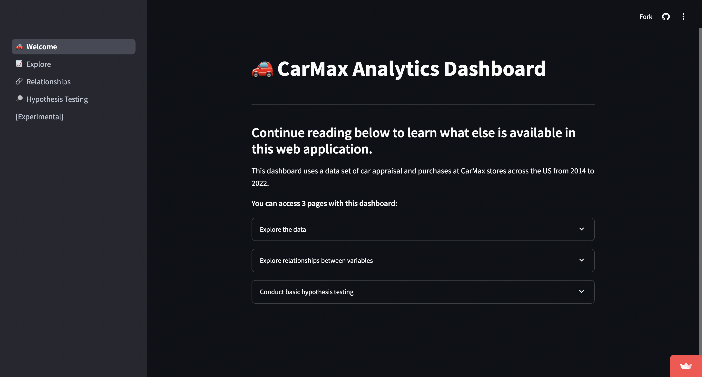
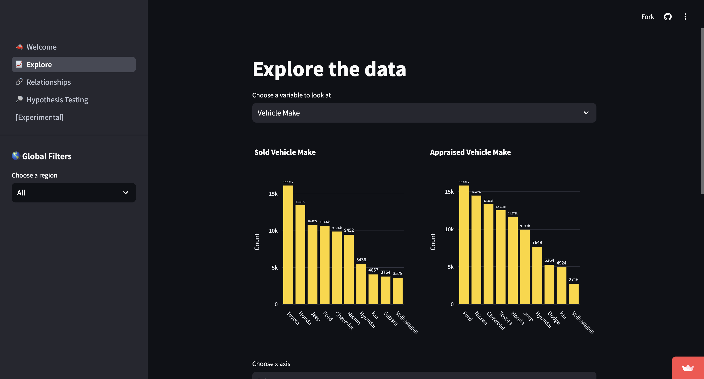
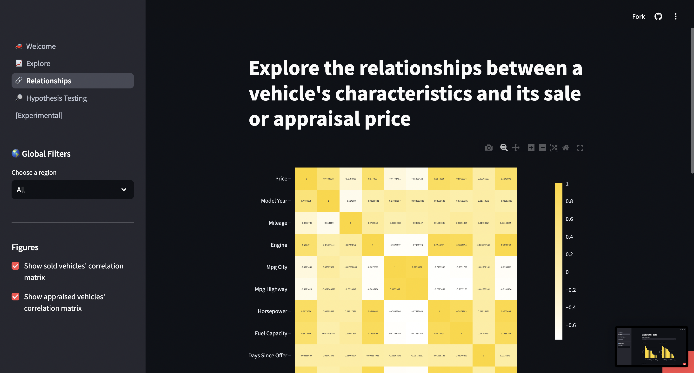
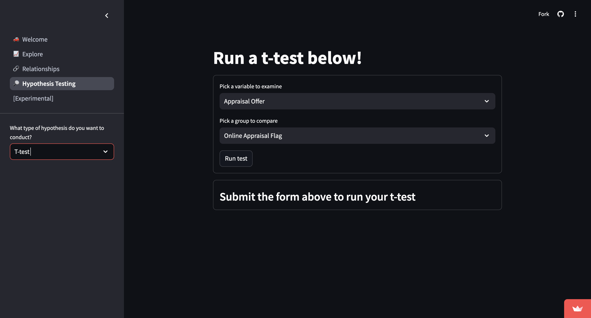

# CarMax Analytics
*If you are visiting from my CV, you can view my R code for the competition in the `comp-code.txt` file.*

  

## Table of Contents
1. [Introduction](#Introduction)
2. [Main Takeaways](#main-takeaways)
3. [Data](#Data)
4. [EDA](#EDA)
5. [Modeling](#Modeling)
6. [Conclusions](#Conclusions)
7. [Dashboarding](#Dashboarding)

## Introduction
The initial problem posed by CarMax for this analytics showcase was to uncover what features were driving CarMax customers' purchases. 

I will use Python programming and dashboarding to explore, model, and cleanly present findings from this data.

## Main Takeaways
1. Standardize in-store appraisal procedures to reduce differences in average appraisal offer between in-store and online interactions
2. Ensure adequate stock of Ford vehicles in Southern distribution channels and Toyota in Western distribution channels
3. Adjust car make recommendations based on appraisal car mileage (show similar brands to people who traded in high-mileage cars)
4. Adjust vehicle type recommendations based on appraisal car mileage (show similar vehicle types to people who traded in high-mileage cars)
5. Make highway MPG, mileage, and price directly visible on each car’s profile to improve ease of shopping for customers

## Data
The provided data contained 132,717 observations and 31 variables. It contained two sets of feature variables. One for describing cars customers brought in for appraisal and another of the same type for the car that customer eventually purchased. It also contained some information about the transaction (whether it occurred online or in-person, what state it was in, etc.). 

## EDA
For my inital exploration of the data, I used a simple python file (`eda/raw-eda.py`). In this file I iteratively write code to explore and clean the data using a side-by-side interactive jupyter notebook session. This allows me to adjust my data while not having to worry about code blocks or markdown cells. The purpose of this file is to do a messier exploration of the entire data, identify areas of interest, and clean up any discrepencies in the data. Then, using sections of the code from this file, I will make focused notebooks that convey a narrative and can be presented to CarMax. 

Structured walkthroughs of the [data exploration](./eda/exploration.ipynb) and [visualization](./eda/visualization.ipynb) can be found in the `eda` folder.

## Modeling
In terms of modeling, I decided to only try a few models. I experimented with a pcr using only quanititative variables, random forest and factor analysis of mixed data with quantitative and categorical variables, and a lasso model with only quantitative variables.

Overall, none of the models performed very well. Interestingly, some of the models returned errors close to 15%, meaning that an inverse model would have performed quite well. These results indicate that there is some fundamental error occuring in the modeling process. Due to time constraints, I decided to focus on visualization, exploration, and dashboarding. 

## Conclusions
My main goals with this project was to focus on exploration and business inference. Using python, I explored and visualized the carmax data to identify trends in vehicle types and across regions. Below are some pictures of my final dashboard.

## Dashboarding
The last part of my project was to translate my findings into a user-friendly dashboard. The dashboard I created allows non-technical users to explore data across all regions or in specific regions. It also allows more technical users to view relationships between variables and conduct hypothesis tests. 

https://github.com/user-attachments/assets/c7bb68ef-5ad3-42bf-ad9f-d51b7d41dce4

